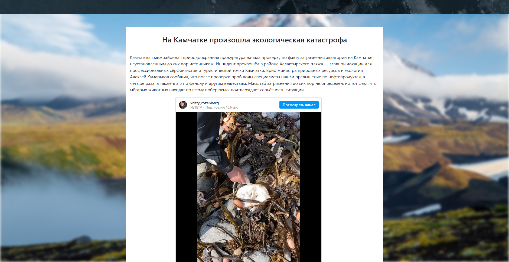
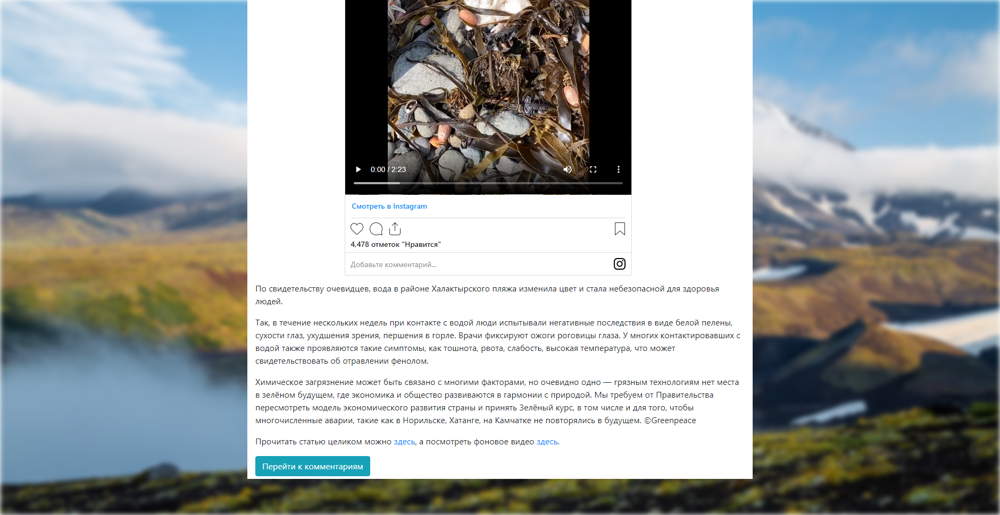
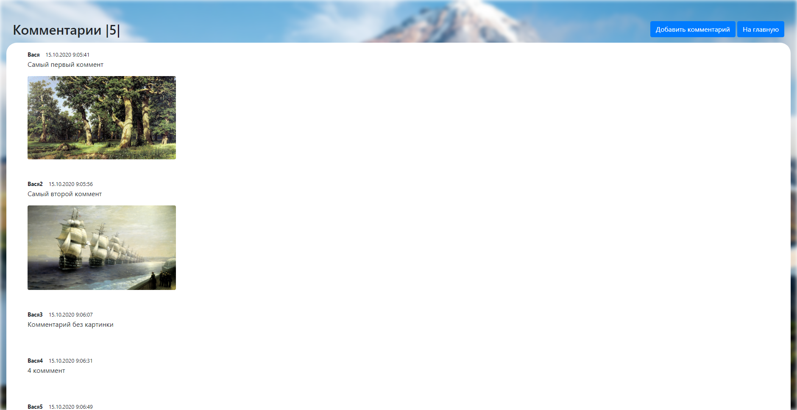
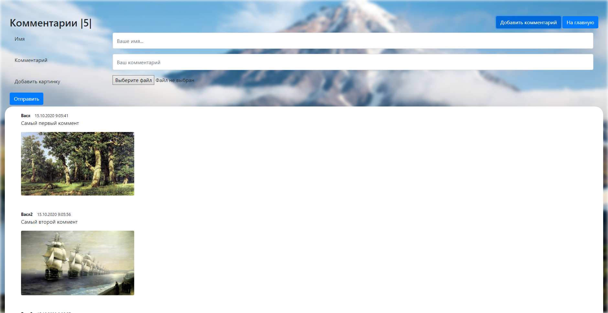
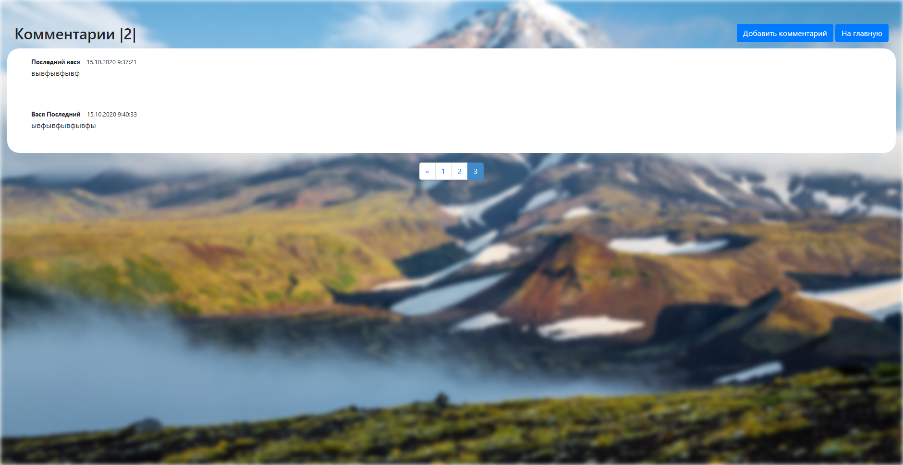

## Develop an ASP.NET MVC application, which allows users to comment on the article displayed on the browser page.
### The main page must contain:
1. Article title;
2. Illustration to the article;
3. Text of article;
4. Link to view comments (optional - indicating the number of comments added).
### The comments page should contain:
1. All comments (nickname, text, time added);
2. Field to add;
3. The add button;
4. After adding the page with comments should be updated.
### Validation of the model when adding a comment (all fields are required, the nickname must consist of three letters, an underscore, and three digits) on the client side and on the server.
### Switch from Russian to Belarusian by clicking on the corresponding button (change the language for all buttons and other interface elements of your choice).
### Full task description you can see [here](ASP_NET_MVC_HW_2.pdf).
## Solution

