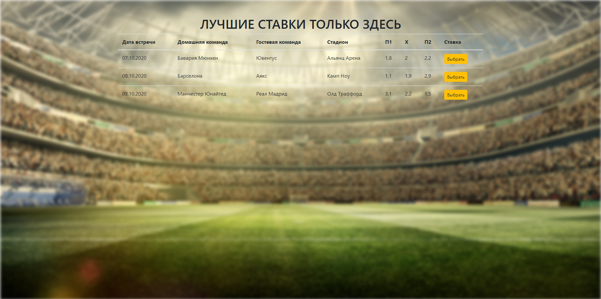

## Develop an ASP.NET MVC application "football sweepstakes" (football betting), in which the user can place bets on the winning of the selected team in the specified game.
#### The tournament schedule must be stored in an XML document.
#### Bets placed are saved in the database. 
#### To create a single application style, create all pages using the main page (MasterPage).
#### When entering the main page, the user sees a table with the schedule of football championship games and the Confirm selection button to go to the page where you can place a bet on the selected team. The selection is made by clicking on the link in the corresponding row of the table.
#### Provide fields for entering the name and amount of money, radio buttons for selecting a team, as well as The bet made and Cancel buttons. When the user fills in all the data and click on the Bids made button, the information should be added to the database and the user should go to the main page. By clicking the Cancel button, the user goes to the main page.
#### Full task description you can see [here](ASP_NET_MVC_HW_1.pdf).
## Solution:

